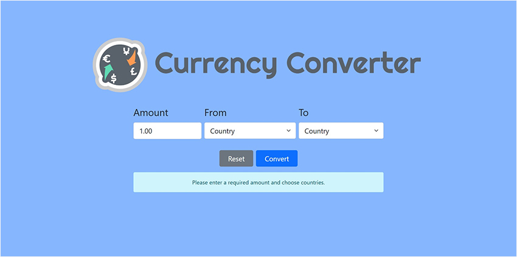
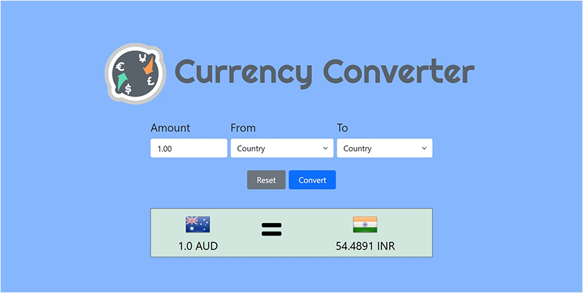
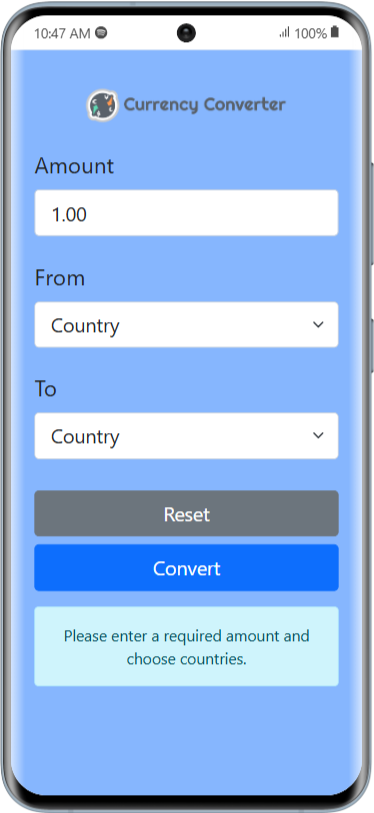
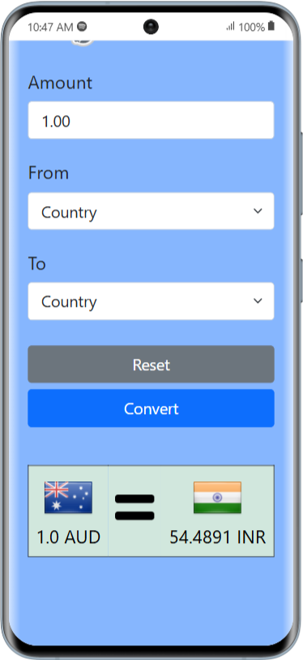

# Currency Conversion
A currency converter is a tool that allows users to calculate the equivalent value of one currency in terms of another. It uses current exchange rates to perform conversions, making it useful for international transactions, travel, or financial planning.

With this currency conversion tool, you'll gain practical knowledge on how to utilize APIs to retrieve currency rates and access images of country flags, enhancing your understanding of API integration in real-world applications. 

## Installing
### Clone the project

```bash
git clone https://github.com/shivatejaburle/currency-conversion
cd currency-conversion
```

### Setup your Virtual Environment
```bash
pip install virtualenv
virtualenv venv
# For Windows
venv\Scripts\activate   
# For Mac
source venv/bin/activate 
```

### Install dependencies
```bash
pip install -r requirements.txt
```

### Environment Settings

Get your API Key from ExchangeRate-API from https://www.exchangerate-api.com/

Create `currency-conversion/.env` to store API Keys.

```bash
CURRENCY_API_KEY = '<YOUR_API_KEY>'
```

### Collect static files (only on a Production Server)

```bash
python manage.py collectstatic
```

### Running a Development Server

Just run this command:

```bash
python manage.py runserver
```
Your application will be available @ http://127.0.0.1:8000/

## Screenshots


&emsp; &emsp;&emsp;&emsp; 